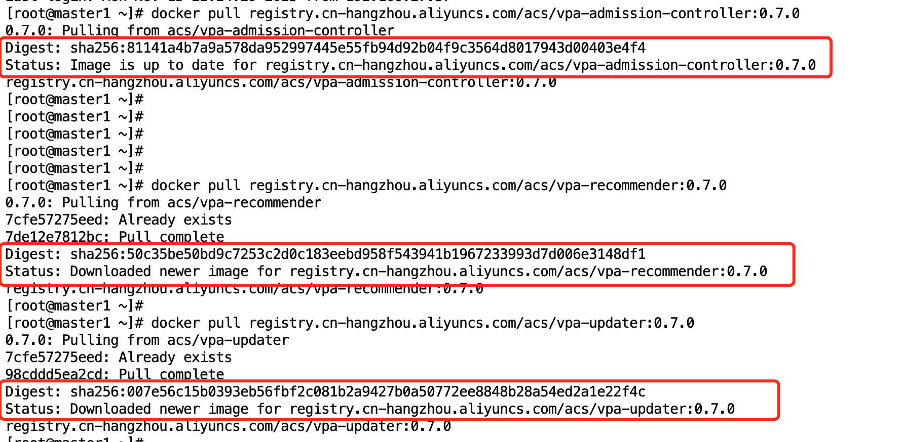
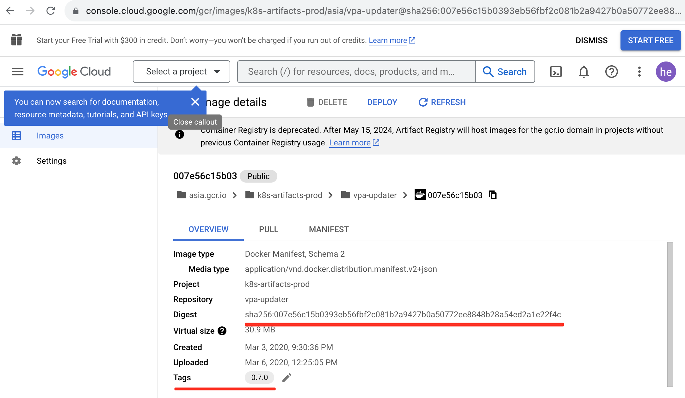

https://cloud.tencent.com/document/practice/457/54756

https://console.cloud.google.com/gcr/images/k8s-artifacts-prod/ASIA/vpa-admission-controller

1

2. k8s.gcr.io/vpa-admission-controller

[root@master1 ~]# docker pull registry.cn-hangzhou.aliyuncs.com/acs/vpa-admission-controller:0.7.0

0.7.0: Pulling from acs/vpa-admission-controller

Digest: sha256:81141a4b7a9a578da952997445e55fb94d92b04f9c3564d8017943d00403e4f4

Status: Image is up to date for registry.cn-hangzhou.aliyuncs.com/acs/vpa-admission-controller:0.7.0

registry.cn-hangzhou.aliyuncs.com/acs/vpa-admission-controller:0.7.0

[root@master1 ~]# docker pull registry.cn-hangzhou.aliyuncs.com/acs/vpa-recommender:0.7.0

Digest: sha256:50c35be50bd9c7253c2d0c183eebd958f543941b1967233993d7d006e3148df1

Status: Downloaded newer image for registry.cn-hangzhou.aliyuncs.com/acs/vpa-recommender:0.7.0

registry.cn-hangzhou.aliyuncs.com/acs/vpa-recommender:0.7.0

[root@master1 ~]# docker pull registry.cn-hangzhou.aliyuncs.com/acs/vpa-updater:0.7.0

Digest: sha256:007e56c15b0393eb56fbf2c081b2a9427b0a50772ee8848b28a54ed2a1e22f4c

Status: Downloaded newer image for registry.cn-hangzhou.aliyuncs.com/acs/vpa-updater:0.7.0

registry.cn-hangzhou.aliyuncs.com/acs/vpa-updater:0.7.0

k8s.gcr.io/vpa-admission-controller

https://console.cloud.google.com/gcr/images/k8s-artifacts-prod/asia/vpa-admission-controller@sha256:81141a4b7a9a578da952997445e55fb94d92b04f9c3564d8017943d00403e4f4/details

k8s.gcr.io/vpa-recommender

https://console.cloud.google.com/gcr/images/k8s-artifacts-prod/asia/vpa-recommender@sha256:50c35be50bd9c7253c2d0c183eebd958f543941b1967233993d7d006e3148df1/details

k8s.gcr.io/vpa-updater

https://console.cloud.google.com/gcr/images/k8s-artifacts-prod/asia/vpa-updater@sha256:007e56c15b0393eb56fbf2c081b2a9427b0a50772ee8848b28a54ed2a1e22f4c/details

